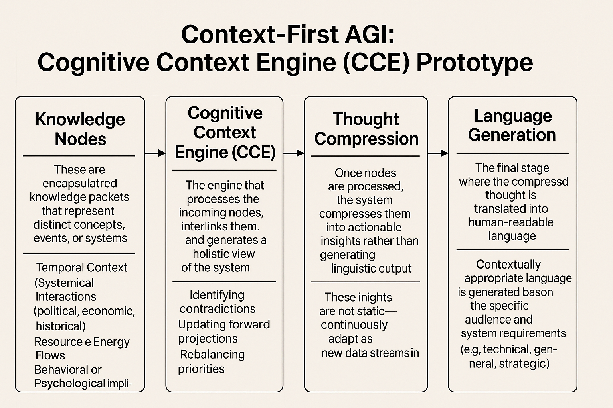

# Cognitive Context Engine (CCE): Thought Before Speech

A research concept for a language system that builds an internal model of context first and only then turns it into words, plus an early Python sketch that uses GPT-2 as a stand-in for the "thinking" step.

> **Status: concept architecture and incomplete Python sketch. The code does not run as committed** (details under [Known issues](#known-issues)). It is not AGI and does not attempt to be one yet: the current "thought" step is plain GPT-2 text generation and the "decision" step is a random or tabular choice.



## Why

Most language models produce text one token at a time and any "reasoning" lives inside that stream. The idea here is to reverse the order: accumulate context, build and revise an internal model of what is going on, compress it into a compact representation, and only then generate language for a specific audience. The long-term goal is a system whose internal state is inspectable and whose outputs follow from it.

## The proposed architecture

1. **Knowledge nodes.** Modular representations of concepts and systems, each with temporal context, relationships (political, economic, historical), flows of resources and influence, and behavioral models. Intended to be stored as multi-dimensional embeddings capturing the *what*, *why* and *how* of a concept.
2. **Cognitive Context Engine.** Links new information to existing knowledge, flags contradictions, recalibrates its model and forecasts, and emits a compressed internal representation.
3. **Thought compression.** Symbolic or vector representations that are not language-first, designed to be interpretable and storable in long-term memory.
4. **Language generation.** Translates compressed thoughts into audience-specific text through a transformer wrapper.

Only small pieces of this exist in code today, as described next.

## What is actually in the repository

| File | Contents |
| --- | --- |
| `cognitive_engine.py` | `CognitiveContextEngine`: keeps the last N inputs in a `deque`, joins them, and runs GPT-2 `generate` on the result as the "thought". `make_decision` picks a random action. `AGISimulation` feeds a few sentences through and prints thought and decision |
| `rl_agent.py` | A second version of the engine with a small tabular Q-learning agent (`RLDecisionAgent`, epsilon-greedy) choosing among actions like Explore / Wait / Ask / Think, rewarded with a random number. Context is ranked by string length and fed through GPT-2 three times ("thought loops") |
| `transformers_wrapper.py` | `TransformerEngine`: loads any Hugging Face causal LM (default `gpt2`) on CPU or CUDA and samples a response |
| `main.py` | Entry point that imports `AGISimulation` from an `agi_core` package |
| `prompts.txt` | Ten open-ended creative prompts for experimenting with the engine |
| `requirements.txt` | `torch`, `transformers`, `numpy` |

## Known issues

As committed, none of the entry points run:

- `main.py` and `cognitive_engine.py` import from `agi_core.*`, but there is no `agi_core` package; the files sit at the repository root.
- `cognitive_engine.py` has two stray module-level lines (`self.transformer = ...` and `response = ...`) that raise `NameError` on import.
- `rl_agent.py` contains a stray `---` line that is a `SyntaxError`.
- `cognitive_engine.py` imports scikit-learn, which is not in `requirements.txt`.
- `transformers_wrapper.py` ends with an unfinished `get_hidden_states` method.

The earlier README also referenced `cognitive_context_engine.py`, `insight_generator.py`, `data_loader.py` and an `api/` folder. Those files do not exist.

## Trying the idea locally

If you want to see the GPT-2 context loop working, the smallest fix is to delete the stray `---` line near the top of `rl_agent.py`, which is otherwise self-contained:

```bash
git clone https://github.com/Mattbusel/Context-First-AGI-Cognitive-Context-Engine-CCE-Prototype.git cce
cd cce
python -m venv .venv && source .venv/bin/activate   # Windows: .venv\Scripts\activate
pip install -r requirements.txt
# remove the line that reads just "---" in rl_agent.py, then:
python rl_agent.py
```

It downloads GPT-2 (about 500 MB) on first run, then prints an input, a GPT-2 continuation labelled "Thought" and a Q-learning "Decision" for each of three sentences.

## Roadmap

- Replace the GPT-2 placeholder with a real context model: knowledge nodes, contradiction detection, compressed state
- Reinforcement learning with meaningful rewards for decision-making
- Long-term memory and recall
- Real-time data streams (news, sensors, logs)
- Dashboards that visualize how the internal model evolves
- Research into embodied cognition through biofeedback

## Contributing

Useful areas: cognitive architectures, symbolic reasoning, RL and planning, graph-based knowledge representation, and language modelling. A good first pull request would be fixing the import layout so `python main.py` runs.
